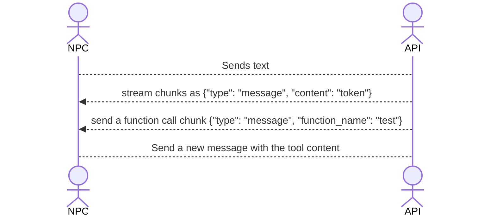

# Post Mortem

At the start of the project, we had a clear vision of what we wanted to achieve and how we wanted to achieve it. 
However, as the project progressed, we encountered several challenges that we did not anticipate and shaped the outcome 
of the project into something that didn't match our initial expectations. The goal of the post mortem is to identify
what caused this result, how it can be improved, and what we learnt from this experience.

## The initial plan

Our initial plan was to fine-tune ministral 3B or 8B to perfectly interact with function calling depending on 
the context of the discussion with the user.

With this fine-tuned model trained on specific datasets of examples of conversations and tool calls, we would have 
something perfectly integrated in the game, capable of interacting with the world as if it was native to the model.

Then, we would give each character a personality, a system prompt, and a list of functions.

The goal was that we configure each NPC on the backoffice with all the tools implemented in game, then each NPC can
interact with the player and the world seamlessly without any more work to do.

We also wanted to implement lore specific data in a RAG dedicated to each NPC, so that game scenarists can make NPC 
perfectly fitting in the game lore, reinforcing the world immersion.

## What failed

We noticed too late during the work that if we fine-tune a model, we're exiting the Mistral API track and were joining 
the fine-tuning one. That's not what we wanted as fine-tuning wasn't the heart of the project.

After noticing this, we had to change our vision of the system :
- We replace the fine-tuned model with the NPC's specific rag containing examples of conversations

When testing on the API side, we had really good results with this approach and had something consistent really fitting 
what we wanted to achieve with a fine-tuned model.

The thing is that, the game wasn't going at the same speed that the API, and **bad communication** led the API to
implement way more features than what the game was ready to take, and so the game dev has been rushed.

Another issue is that everything was first planned to work with the fine-tuned model, trained on specific data formats.
When switching to the rag approach, we had lost a lot of time and didn't reconsider our approach of data consistency.
So, we implemented a really basic function calling system, with no data consistency and a bad management of the functions.

### The management of functions

What have broke the whole NPCs comportment is that we badly managed function calling with the game, the process we made was the following :


When it can seems correct here, there is in reality no distinction between the player input and the tool response.
Knowing that the API uses LangChain to manage the session, it means that when the tool is responded, the LLM receives this :
```json
[
  {
    "type": "system",
    "data": {
      "content": "The NPC's system prompt"
    }
  },
  {
    "type": "human",
    "data": {
      "content": "Initial user message"
    }
  },
  {
    "type": "ai",
    "data": {
      "content": "AI response",
      "additional_kwargs": {
        "tool_calls": [
          {
            "id": "call_abc123xyz",
            "type": "function",
            "function": {
              "name": "get_weather",
              "arguments": "{\"location\":\"Paris\",\"unit\":\"celsius\"}"
            }
          }
        ]
      }
    }
  },
  {
    "type": "human",
    "data": {
        "content": "TOOL CALL 'get_weather' RESPONSE : The weather at Paris is 18°C"
    }
  }
]
```

And the main issue that poisoned NPCs context is here : We return the tool response as the user response, not as a tool 
response. This totally break the context consistency of the LLM who thinks that the tool response is in fact something the user told.

If we had kept a true data consistency, and a proper function management, the result would have be way better, with a 
better understanding of the NPC regarding the user discussion and the world interactions.

### Agentic workflow

We didn't introduce any agentic workflow on the discussions, meaning there is no input clean up, no prompt improvement, etc

Implementing agentic workflow could have empower the function calling and the context awareness of the NPCs

## What we learned

For a first hackaton with really disparate competences and few experience with Unity, we're still satisfied of the 
result we achieved. But it's important to us to do this post mortem in order to learn from the mistakes we made here, 
and make sure to not reproduce them in the future.

### Our errors

The main errors we've noticed :

- **A polished feature is more than a lot of mess :** One of our big issues, while we implemented Voxtral for voice input 
and later ElevenLabs TTS streaming for NPCs response, we didn't had a working function management that was poisoning our NPCs.
We should better polish the main feature (NPCs interactions with the player and the world) rather than implement more things.
- **Time is critical, but communication is even more :** With the delay we've experienced, we were time critical to 
finish the project; that's one of the reason we put communication aside, and it's one of our worst error that empowered
the bad function management.
- **Plan more, build less :** The majority of the issues we had could have been avoided if we took time to correctly plan
how we wanted our technical implementation. For example, how the function management should work, how we implement an 
agentic workflow to improve the discussion, how we manage the response stream, etc...
- **Structured data are not a decoration :** Structuring data is mandatory to guarantee the consistency of a LLM. A LLM
  is still a computer, and a computer needs structured datas to work properly.

### Successes

Even tho there is some error to take into account, the most important stay what we learnt from this project :
- **Using RAG with conversation instead of fine-tuning :** While for a game fine-tuning can be expensive and too rigid,
using a RAG of conversation examples seems to provide consistent results that can be adjusted if needed to fully match
the expected NPC behaviour.
- **The end-to-end voice pipeline :** Getting Voxtral STT streaming over WebSocket and ElevenLabs TTS both working and
chained together in 48h is a real achievement. The latency is acceptable and the experience feels natural, which is the
hardest part to get right with voice in games.
- **The API-driven NPC architecture :** Decoupling NPC configuration from the game itself was the right call. A game
designer can update a character prompt, add a tool or inject new conversation examples in the backoffice without
touching the game build. This is the kind of workflow that would allow resilience in a production context.
- **Pivoting without losing the vision :** Realising mid-hackaton that fine-tuning was the wrong track and being able
to switch to RAG while keeping the same architecture and the same goal is not trivial. Adaptability is the key.

## Final result

Despite the issues, the core concept works : a player can walk up to an NPC, speak or type, get a contextually relevant
response in voice and text, and trigger real in-game actions, all driven by ministral. The result is below our expectations,
but is still able to demonstrate the potential of LLM-powered NPCs in games, to reinforce immersion and possibilities.

With better management, planning, and focus on the core features, we could significantly improve the NPCs behaviour and 
make something consistent and production ready. This project is a first step in that direction, and we are excited to 
keep exploring and improving this concept in the future.