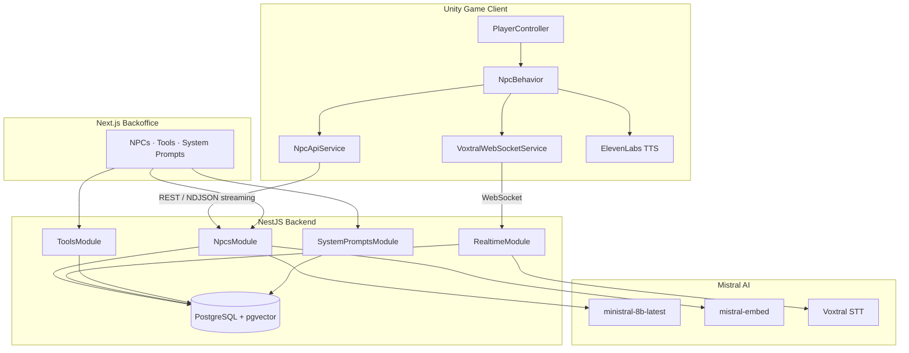
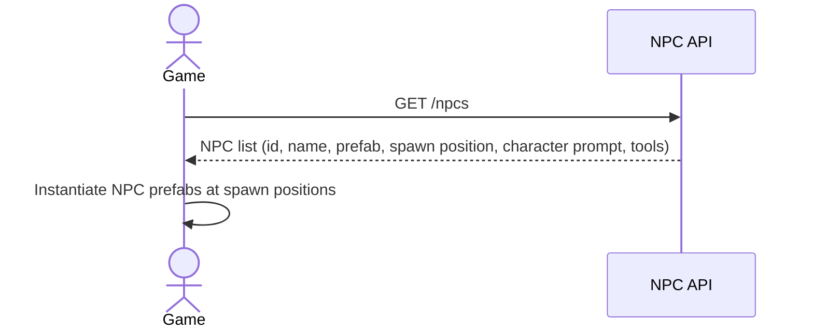
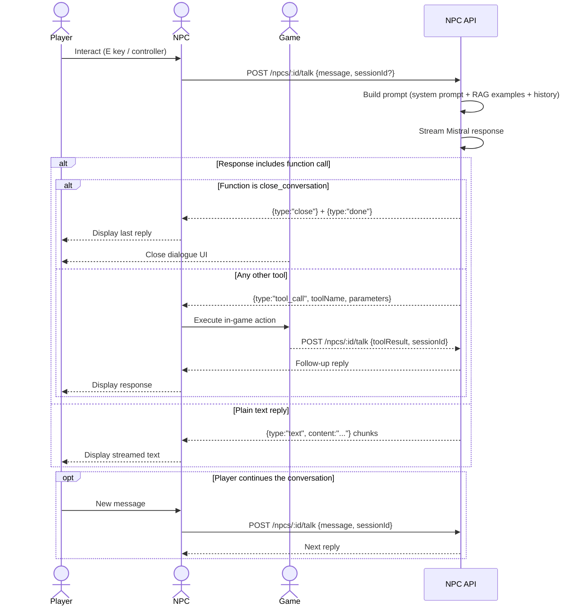
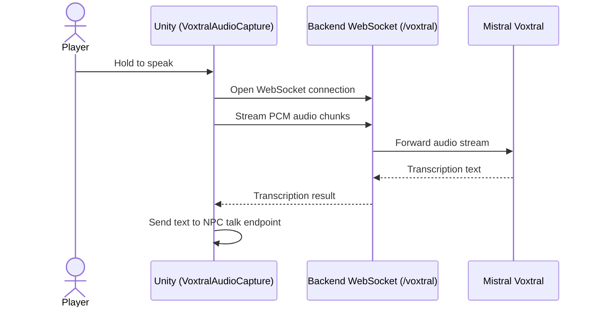

# Living NPCs — Mistral Worldwide Hackathon (Online Edition 2026)

A proof-of-concept demonstrating dynamic, AI-driven NPC interactions in a 3D game, built in 48 hours during the [Mistral Worldwide Hackathon — Online Edition](https://luma.com/mistralhack-online).

Players can speak to (or type at) NPCs using natural language. NPCs respond with voice and text, and can trigger real in-game actions through function calling — all powered by [Mistral AI](https://mistral.ai).

> A POST_MORTEM retracing what we expected to build, what we actually built, the issues we encountered, the final result and the lessons learned from this hackaton can be found in [POST_MORTEM.md](POST_MORTEM.md).

---

## Repositories

This project is composed of two submodules:

| Repo | Description |
|------|-------------|
| [`mistral-hackaton-online-2026-backoffice`](https://github.com/KysioD/mistral-hackaton-online-2026-backoffice) | NestJS API + Next.js backoffice for managing NPCs, tools, and system prompts |
| [`mistral-hackaton-online-2026-unity`](https://github.com/KysioD/mistral-hackaton-online-2026-unity) | Unity 6 game client with NPC interaction and audio capture |

---

## Features

- **Text & voice interaction** — players can type or speak to NPCs; NPCs respond in both text and synthesized voice (via ElevenLabs TTS)
- **Function calling** — NPCs can execute in-game actions (sell items, inspect player, give quests, close conversation…) based on the dialogue context
- **Streaming responses** — NPC replies are streamed in real time via NDJSON so the experience feels immediate
- **Real-time speech-to-text** — microphone audio is streamed to [Voxtral](https://mistral.ai/news/voxtral) over WebSocket for low-latency transcription
- **RAG per NPC** — each NPC has a set of conversation examples stored as vector embeddings; the most relevant ones are injected as few-shot context before each reply, improving consistency and personality
- **API-driven NPC management** — NPCs, their character prompts, and their available tools are stored in a database and managed through a backoffice UI; no game rebuild required to update an NPC
- **Session-based conversation history** — the full message history is persisted per session so NPCs remember what was said earlier in the conversation

## Architecture



### Technology Stack

| Layer | Technology |
|-------|-----------|
| Game client | Unity 6.3 LTS (6000.3.9f1), C# |
| Backend API | NestJS 11, TypeScript |
| Database | PostgreSQL + pgvector (via Prisma ORM) |
| Backoffice UI | Next.js 14, Tailwind CSS, shadcn/ui |
| LLM | Mistral (`ministral-8b-latest`) |
| Embeddings | Mistral (`mistral-embed`, 1024 dimensions) |
| Speech-to-text | Voxtral (`voxtral-mini-transcribe-realtime-2602`) |
| Text-to-speech | ElevenLabs |
| Containerisation | Docker Compose |

---

## How It Works

### 1 — Loading NPCs at startup



### 2 — Talking to an NPC



### 3 — Voice input (Voxtral)



### RAG — Per-NPC Conversation Examples

Each NPC has a set of example conversations stored in the database as 1 024-dimensional vector embeddings (`mistral-embed`). Before each LLM call, the backend performs a cosine similarity search and injects the top 3 most relevant examples as few-shot context inside the system prompt. This keeps the NPC's tone, vocabulary, and behaviour consistent without fine-tuning.

---

## Data Model (simplified)

```
Npc
 ├── characterPrompt
 ├── tools: NpcTool[]          ← available function calls
 ├── sessions: Session[]       ← conversation history
 └── conversationExamples[]    ← RAG corpus (with embeddings)

Tool
 ├── name, description
 └── parameters: ToolParameter[]

SystemPrompt (one active at a time)
 └── content                   ← global world / game context

Session
 └── messages: Message[]       ← full turn-by-turn history
```

---

## NPC Streaming Response Format (NDJSON)

The `/npcs/:id/talk` endpoint streams newline-delimited JSON events:

```jsonc
{"type": "text",      "content": "Bonjour, voyageur..."}
{"type": "text",      "content": " Que puis-je pour toi ?"}
{"type": "tool_call", "id": "abc", "toolName": "sell_item", "parameters": {"item": "health_potion", "price": 50}}
{"type": "close"}
{"type": "done",      "sessionId": "...", "message": {...}, "closed": true}
```

---

## Getting Started

### Prerequisites

- **Docker & Docker Compose**
- **Unity** 6.3 LTS (6000.3.9f1)
- A **Mistral API key**

### 1 — Clone with submodules

```bash
git clone --recurse-submodules https://github.com/KysioD/mistral-living-npc.git
cd mistral-living-npc/mistral-hackaton-online-2026-backoffice
```

### 2 — Configure environment variables

```bash
cp backend/.env.example .env
```

Edit `.env` and fill in your Mistral API key. Everything else can stay as-is for Docker:

```env
MISTRAL_API_KEY="sk-..."
LLM_MODEL="ministral-8b-latest"
VOXTRAL_MODEL="voxtral-mini-transcribe-realtime-2602"
# DATABASE_URL is overridden automatically by docker-compose
```

### 3 — Start the full stack

```bash
docker-compose up -d
```

| Service | URL |
|---------|-----|
| Backoffice UI | http://localhost:3000 |
| Backend API | http://localhost:3001 |
| Voxtral WebSocket | ws://localhost:8080/voxtral |

### 4 — Open the Unity project

Open `mistral-hackaton-online-2026-unity/` in Unity 6.3 LTS. In the `AppConfig` component, set:
- **Base URL** → `http://localhost:3001`
- **Voxtral Base URL** → `ws://localhost:8080`

Then hit Play.

---

## Backoffice

The Next.js backoffice lets you manage everything without touching the game or the code:

| Section | What you can do |
|---------|----------------|
| **NPCs** | Create / edit / delete NPCs, set character prompt, assign tools, add conversation examples |
| **Tools** | Define function-calling tools and their parameters |
| **System Prompts** | Write the global world context injected into every NPC conversation |

---

## In-Game Controls

> Keybindings adapt to keyboard layout. Described for US QWERTY + Xbox Series X/S controller.

| Action | Keyboard | Controller |
|--------|----------|-----------|
| Move | WASD | Left Stick |
| Look | Mouse | Right Stick |
| Jump | Space | A |
| Sprint | Left Shift | Left Stick Press |
| Interact with NPC | E | Y |
| Pause / Close UI | Esc | Start |

---

## Limitations & Future Work

The RAG approach already produces very consistent NPC behaviour with `ministral-8b-latest`. The main remaining bottleneck is function calling reliability on smaller models.

- **Fine-tuning for function calling** — a well fine-tuned `ministral-3b` would likely match or exceed the current results at a fraction of the cost and latency. The annotated datasets included in the backend repo (`dataset/` and `dataset/`) are a starting point for that.
- **More NPC variety** — the system is fully data-driven; adding new characters only requires writing a character prompt, a set of example conversations, and assigning tools in the backoffice.
- **Persistent memory** - Using this system, we can easily store and retrieve long-term memories for each NPC, allowing them to remember past interactions with the player across sessions and react accordingly, and even to share memories between NPCs to create a more cohesive world.
- **Prompt tuning** - Even tho the RAG approach permited us to have more consistent NPC personalities, it still needs some prompt tuning to get the best out of it.
- **Better tool call handling** - Due to the short delay and the quantity of work, the function calling implementation on Unity's side is quite dirty, and it has an impact on the model quality. A more robust implementation and a more structured data format for tool calls would likely improve results significantly.

---

## Project Structure

```
mistral-living-npc/
├── mistral-hackaton-online-2026-backoffice/
│   ├── backend/                   NestJS API
│   │   ├── src/
│   │   │   ├── npcs/              NPC CRUD + /talk streaming endpoint
│   │   │   ├── tools/             Tool definitions
│   │   │   ├── system-prompts/    Global system prompt management
│   │   │   ├── realtime/          Voxtral WebSocket gateway
│   │   │   └── prisma/            DB service
│   │   └── prisma/
│   │       └── schema.prisma
│   ├── frontend/                  Next.js backoffice UI
│   ├── dataset/
│   │   ├── edgar/                 25 annotated conversation JSONs (FR)
│   │   └── mao_mao/               50 annotated conversation JSONs (FR + EN)
│   ├── docker-compose.yml         Full stack
│   └── docker-compose.db.yml      Database only
└── mistral-hackaton-online-2026-unity/
    └── Assets/Scripts/
        ├── io/                    HTTP + WebSocket clients
        │   ├── NpcApiService.cs
        │   └── VoxtralWebSocketService.cs
        ├── npcs/                  NPC behaviour & function execution
        │   ├── NpcBehavior.cs
        │   └── functions/         INpcFunction implementations (seller, apothecary…)
        ├── audio/                 Microphone capture for Voxtral
        └── ui/                    Dialogue UI
```

---

## Team

Built in 48 hours for the [Mistral Worldwide Hackathon — Online Edition 2026](https://luma.com/mistralhack-online).

| | Role |
|-|------|
| **[Hugo (KysioD)](https://github.com/KysioD)** | Project lead · Unity development |
| **[Louka (0n3m0r3)](https://github.com/0n3m0r3)** | Backend API · Backoffice UI |
| **[Alexis (SeedenDev)](https://github.com/SeedenDev)** | Unity development |
